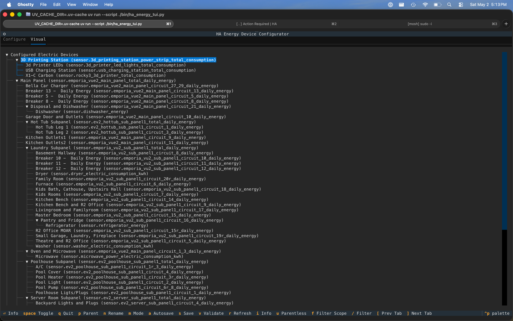
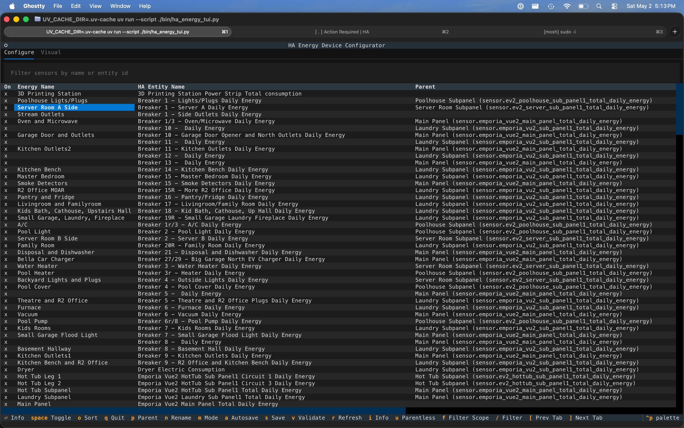

# HA Energy TUI

A terminal UI for configuring Home Assistant Energy dashboard device consumption entries.

It talks to Home Assistant through the websocket API. It does not edit `.storage`
files directly.

## Screenshots





## Status

Alpha. This started as a local tool for making a large Energy dashboard setup less
painful to maintain. It works, but expect rough edges and keep backups.

## Features

- Configure Energy dashboard device consumption sensors from a TUI.
- Switch between electric and water device configuration.
- Assign parent devices for nested circuits or meters.
- Rename the Energy dashboard label without changing entity IDs.
- Stage Home Assistant entity display-name updates.
- Visual tree explorer for parent/child relationships.
- Autosave, manual save, dirty-state warnings, and refresh confirmation.
- Filter by entity ID, dashboard label, HA entity name, and parent.
- Column selection and ascending/descending sorting.
- Uses `aiohttp` websocket client with heartbeat support.

## Install

With `uv`:

```bash
uv tool install git+https://github.com/rockyolsen/ha-energy-tui
```

For local development:

```bash
git clone https://github.com/rockyolsen/ha-energy-tui
cd ha-energy-tui
uv sync
uv run ha-energy-tui --help
```

## Home Assistant Setup

Create a long-lived access token in Home Assistant:

`Profile -> Security -> Long-lived access tokens`

Then export connection details:

```bash
export HASS_SERVER=https://homeassistant.local:8123
export HASS_TOKEN=your-long-lived-access-token
```

For self-signed or local certificates, SSL verification is disabled by default.
Pass `--verify-ssl` if you want certificate verification enabled.

## Usage

```bash
uv run ha-energy-tui
```

Useful options:

```bash
ha-energy-tui --list
ha-energy-tui --prefs-summary
ha-energy-tui --server https://homeassistant.local:8123 --token "$HASS_TOKEN"
```

## Key Bindings

| Key | Action |
| --- | --- |
| `q` | Quit, prompting if there are unsaved changes |
| `s` | Save staged changes |
| `a` | Toggle autosave |
| `r` | Refresh from Home Assistant, prompting if dirty |
| `v` | Run Home Assistant energy validation |
| `m` | Toggle electric/water mode |
| `[` / `]` | Move between Configure and Visual tabs |
| `/` | Focus filter |
| `f` | Cycle filter scope |
| `space` | Toggle configured device or expand/collapse visual node |
| `enter` | Show selected device details |
| `p` | Pick parent device |
| `n` | Rename dashboard label / HA entity display name |
| `u` | Toggle parentless-only filter |
| `h` `j` `k` `l` | Vim-style navigation |
| `pageup` / `pagedown` | Page navigation |
| `o` | Sort selected Configure table column, toggling asc/desc |

## Safety Notes

- The app writes Energy dashboard preferences through `energy/save_prefs`.
- HA entity display-name changes use `config/entity_registry/update`.
- It does not change entity IDs.
- It does not write directly to Home Assistant `.storage` files.
- Validate and review your Energy dashboard after saving.

## Development

```bash
uv sync --all-extras
uv run pytest
uv run ruff check .
uv run ha-energy-tui --help
```

The package uses a standard `src/` layout. The CLI entry point is:

```text
ha-energy-tui = ha_energy_tui.app:main
```

## Contributing

Issues and pull requests are welcome. Please include:

- Home Assistant version
- Python version
- How you installed the tool
- A description of the Energy dashboard setup you were editing
- Terminal and OS details for TUI rendering bugs

## License

MIT
